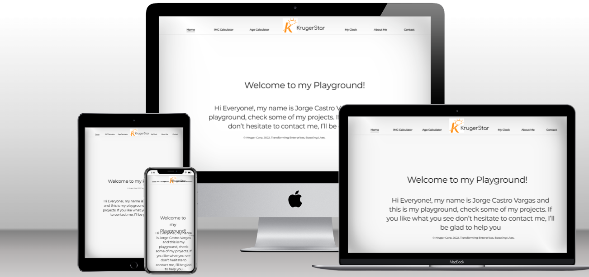

# Portfolio

- In this repository you can find My Playground.

## Built With

- HTML
- CSS
- Git
- JavaScript
- React

## Getting Started

**In this repository I created my personal Playground with some of my projects.**

## Run it

Use the following steps to run this Portfolio locally:

- open the terminal

- get in the directory you want this folder to appear

- put: git clone `git@github.com:jeici21/playground-kruger.git`

- open the folder with a code editor (VS Code preferred)

- go to the index.html file and open it with live server

### Deployment

For a live demo please click on the following link:

https://playground-kruger-jeici21.netlify.app/

## Authors

👤 **Jorge Castro Vargas**

- GitHub: [@jeici21](https://github.com/jeici21)
- Twitter: [@cijei21](https://twitter.com/cijei21)
- LinkedIn: [Jorge Castro Vargas](https://www.linkedin.com/in/jorge-castro-vargas-7242a8129/)
- Facebook: [Jorge Castro Vargas](https://www.facebook.com/jeici21/)

## 🤝 Contributing

[Juan Sotomayor](https://github.com/Juanse7793) - Tutor front ks